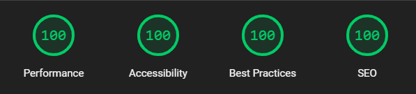

# nuxt-static-landing-page-template (nuxt, typescript, tailwind, tailgrids)


## Demo

[](https://funny-cassata-d205d1.netlify.app)

Demo: <https://funny-cassata-d205d1.netlify.app//>

## General

Setting up small static websites to present a company or a product often takes much more time than initially expected. This repository is intended to simplify the start for developers which prefer nuxt. Due to the server side rendering functionality of nuxt, the site is also relatively performant and quite good for SEO.

Warning: Components in ./components are free components provided by tailgrids. Their terms of use apply. <https://tailgrids.com/license>.

## Includes

- Nuxt 3
- Typescript
- Tailwind (incl night mode)
- Sass
- ESLint using @nuxt/eslint <https://eslint.nuxt.com/packages/module> and Prettier
- Tailgrids
- Localization with nuxt/i18n
- Icons via Iconify
- Smooth Scrolling
- Image Optimization using `<NuxtImg>`
- animations and intersection animations via animista
- placeholder images generated with dalle <https://openai.com/index/dall-e-3/> and logoipsum <https://logoipsum.com/>
- favicons generated using <https://favicon.io/>
- contact form via web3form <https://web3forms.com/>
- cookie banner
- seo and accessibility optimization (aria-labels, head, alt ...)

## Lighthouse Scores

[](https://pagespeed.web.dev/analysis/https-funny-cassata-d205d1-netlify-app/6pooz8d7qw?form_factor=desktop&category=performance&category=accessibility&category=best-practices&category=seo&hl=en-US&utm_source=lh-chrome-ext)

<https://pagespeed.web.dev/analysis/https-funny-cassata-d205d1-netlify-app/6pooz8d7qw?form_factor=desktop&category=performance&category=accessibility&category=best-practices&category=seo&hl=en-US&utm_source=lh-chrome-ext/>

## Potential Future Work

- get rid of tailwind plugin `tailgrids/plugin` (seems to override some configurations)
- add fancy stuff (special animations, 3d, ai chat)
- integrate some analytics tools (posthog, umami, sentry, hotchar ...)

## How to use this template for your own website

- Replace all content (`./components`) or just modify images, text, urls ...
- update assets in `./public` and `./assets`
- update nuxt config
- remove unused languages from `i18n.config.ts` and update the localization files in `./locales`
- add additional animations from animista to `assets\css\main.css`, especially for entryanimations for viewport intersections
- update website head information in `./websiteHead.ts`
- publish using any provider e.g. netlify or vercel

## Documentations

- Nuxt: <https://nuxt.com/docs/getting-started/introduction>
- Vue: <https://vuejs.org/>
- Nuxt/Typescript: <https://nuxt.com/docs/guide/concepts/typescript>
- Nuxt/Tailwind: <https://tailwindcss.com/docs/guides/nuxtjs>
- TailGrids: <https://tailgrids.com/> (using free components)
- i18n: <https://i18n.nuxtjs.org/>
- Iconify: <https://iconify.design/docs/usage/css/tailwind/>
- all icons: <https://icon-sets.iconify.design/>
- animista: <https://animate.style/>

## Setup / Install dependencies

```bash
npm install
```

## Development Server

Start the development server on `http://localhost:3000`:

```bash
npm run dev
```

## Production

Build the application for production:

```bash
npm run build
```

Locally preview production build:

```bash
npm run preview
```

Check out the [deployment documentation](https://nuxt.com/docs/getting-started/deployment) for more information.
